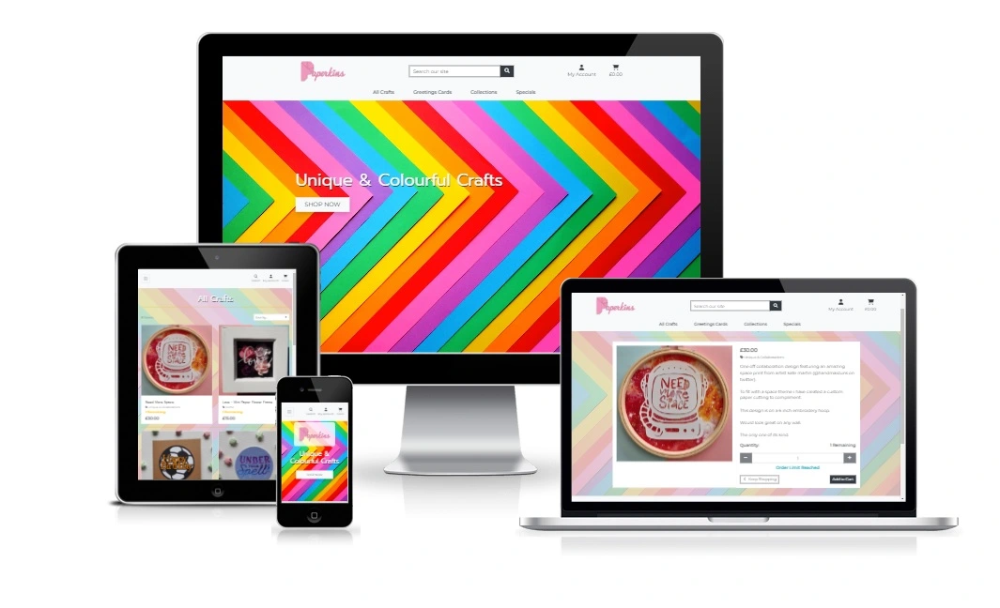

# **Paperkins Crafts**

### **Table Of Contents**
Rather than reinventing the wheel, at the top of this section you will find a table of contents that is auto populated by GitHub.
This will remain fixed to the top, even when you scroll through the readme.

## **Project Overview**

The aim behind this project is to demonstrate my skills in developing a Full Stack Application using the Django framework. I have chosen to create a fully functioning online e-commerce application focused around the sale of handcrafted gifts, where users will be able to browse available products, purchase, and review previous orders.

* **Django Full Stack Project**: Build a Django project backed by a relational database to create a website that allows users to store and manipulate data records about a particular domain.

* **Multiple Apps**: The project must be a brand new Django project, composed of multiple apps.

* **Data Modeling**: Design a relational database schema well-suited for the domain.

* **User Authentication**: The project should include an authentication mechanism, allowing a user to register and log in, and there should be a good reason as to why the users would need to do so.

* **User Interaction**: Include at least one form with validation that will allow users to create and edit models in the backend.

* **Use of Stripe**: At least one of your Django apps should contain some e-commerce functionality using Stripe. This may be a shopping cart checkout or single payments, or donations, etc. After paying successfully, the user would then gain access to additional functionality/content on the site. Note that for this project Stripe's test functionality should be used, rather than actual live payments.

* **Structure and Navigation**: Incorporate a main navigation menu and structured layout.

* **Use of JavaScript**: The frontend should contain some JavaScript logic you have written to enhance the user experience.

* **Documentation**: Write a README.md file for the project that explains what the project does and the value that it provides to its users.

* **Version Control**: Use Git & GitHub for version control.

* **Attribution**: Maintain clear separation between code written by you and code from external sources (e.g. libraries or tutorials). Attribute any code from external sources to its source via comments above the code and (for larger dependencies) in the README

* **Deployment**: Deploy the final version to a hosting platform such as Heroku.

* **Security**: Make sure to not include any passwords or secret keys in the project repository. Make sure to turn off the Django DEBUG mode, which could expose secrets.

### **Main Technologies**:

* HTML, CSS, JavaScript, Python+Django

* Relational database using PostgreSQL

* Stripe payments

* Additional libraries and APIs

---

# **User Experience (UX)** 

## **User Stories**:

* ### First Time Visitor Goals:
  * As a first time visitor, I want to easily understand the main purpose of the site.

  * As a first time visitor, I want to be able to navigate the site to find content easily.

  * As a first time visitor, I want to be able to browse through the available products.

  * As a first time visitor, I want to be able to purchase something without having to create an account.

* ### Returning Visitor Goals:
  * As a returning visitor, I want to create an account.

  * As a returning visitor, I want to login to my account.

  * As a returning visitor, I want to be able to purchase something and make a payment.

  * As a returning visitor, I want to view my orders history.

  * As a returning visitor, I want to contact the seller with a general enquiry.

* ### Frequent Visitor Goals:
  * As a frequent visitor, I want to subscribe to a newsletter.

  * As a frequent visitor, I want to change my account password.

  * As a frequent visitor, I want to save my delivery information.

  * As a returning visitor, I want to contact the seller with a delivery enquiry.

* ### Admin Goals:
  * As an Admin, I want to create a new category.

  * As an Admin, I want to add a new product.

  * As an Admin, I want to view a list of users subscribed to the newsletter.

  * As an Admin, I want to respond to users query.

  * As an Admin, I want to remove a product.

  * As an Admin, I want to update/change a product.

  * As an Admin, I want to view a list of orders.

---

# **Frontend Design**

## **Typography**:
  * Two fonts are used throughout the project, Montserrat is used for all main text, along with Prompt being used for headings. Sans Serif is used as the fallback font in case for any reason the font is not being imported into the site correctly.

## **Imagery**:
  * Imagery is especially important in this project, the background image is used throughout the website, with an overlay on each page except the home page, which brings UI element into focus, rather than having a powerful background distract the user.

  * Imagery is also used to display product images to users, allowing users to view what the final product looks like, which will help to make their purchasing decisions easier.

# **Features**

### **Home Page**:

  This is the page that the user will be greeted with upon arriving at the site, and can be accessed at anytime by clicking either the **Paperkins Logo** or **Home** link in the navigation bar/menu (mobile only).

  This page will consist of a navigation bar/menu along the top, containing the Paperkins logo, along with links to other pages within the web application, providing different links if the user is logged in, and if the user is Admin.

  

  Below the navigation bar/menu will be displayed a hero image containing a short tag line, and a call to action button, inviting the user to start shopping.

  
  
---

### **Products Page**:

  This is the page that the user will be greeted with upon arriving at the site, and can be accessed at anytime by clicking either the **Paperkins Logo** or **Home** link in the navigation bar/menu (mobile only).
  
  This page will consist of a navigation bar/menu along the top, containing the Paperkins logo, along with links to other pages within the web application, providing different links if the user is logged in, and if the user is Admin.

  Below the navigation bar/menu will be displayed a hero image containing a short tag line, and a call to action button, inviting the user to start shopping.

  

  There will also be a footer at the bottom the page, which will appear on each page except the home page. Giving the user a consistent location to find further company information, social links, and ability to contact the site owner / sign up to a newsletter.

  
  
---

### **Product Details Page**:

  This is the page that the user will be greeted with once clicking on a product from the products page.

  This page will consist of a large image of the product, along with all the product information. Including price, category, description, and if the product is in stock or not.

  The user will also be able to adjust the number they wish to purchase, and if happy with the product can click a button to add it to their shopping cart.

  There will also be a button to return to the products page.

  

  When the user clicks on the "Add to cart" button the product and quantity is added to the cart, and a notification is displayed to confirm this.

  

  If the logged in user has admin permissions, there will also be the option to edit or delete the selected product.
  
---

### **Cart Page**:
  This page will only be accessible by clicking on the cart icon in the navigation menu.

  When clicked this will take the user to a page dedicated displaying the products the user has added to the cart. The total cost of each product in the cart, along with the delivery charge and grand total for the order.
  
  If no items have been added to the cart, a message will be displayed to the user, prompting them to start shopping.

  The cart page will give the user a break down of all the products they have added to the cart, along with the current quantity they wish to order, with the ability to change the order quantity, or remove a product from the cart entirely.

  If the user is happy with the products/quantity and wishes to process their order, they are provided with a button to proceed to a secure checkout. Otherwise they are prompted to keep shopping.

  

---

### **Checkout Page**:
  Once the user clicks on the secure checkout button, they are presented with another order summary on the right, along with a form for them to complete their name, email address, phone number, and delivery information. With the option for the user to save their delivery information to their profile (if they are signed in), or to login/register (if they are not signed in).

  At the bottom of the delivery information is a section for the user to enter their card details.

  

  If valid card details have been provided, clicking the complete order button will attempt to take a payment from the users card.

  During this stage the screen will be blanked, and show a message to the user that their payment is being processed.

  If the payment fails, the user is taken back to the form to check why the payment didn't complete, after taking any corrective actions they need to.

  If the payment is successful, the users order is processed, an order confirmation email is sent to the user, and a "Thank You" page is displayed with the final order summary page.

  The user is then prompted to take a look at the available limited edition items available to purchase, using a call to action button.

  

---

### **Add Product Page**:
  This page will only be accessible to Admin users, and is available from the My Account drop down.

  When clicked this will take the Admin user to a page dedicated to adding a new product, where they will be able to add all the required product information, to successfully add a product and have it displayed on the products page.

  
  
---

### **Edit Product Page**:
  This page will only be accessible to Admin users, and is available by clicking the edit button on a selected product.

  When clicked this will take the Admin user to a page dedicated to editing an existing product, where they will be able to change all the required product information, to successfully update a product and have it displayed on the products page.

  All existing product information will be pre-filled to allow the Admin user to easily see what information is currently displayed for the selected product.

  
  
---

### **Profile Page**:
  This page will only be accessible to Users that have registered, and are signed in. This page will be presented when clicking the "My Profile" link in the "My Account" drop down.

  When clicked this will take the User to a page dedicated to the User.

  It will provide the user a place to update their default delivery information, view order history, change their password, and update their email addresses.

  If a user has not created an order, they will be informed of this under the Order History heading.

  If a user has previously created an order / made a purchase, they will see a list of all previous orders, and clicking on the order number will direct the user to an order summary.

  
  
---

### **Customer Queries Page**:
  This page will only be accessible to Admin users. This page will be presented when clicking the "Customer Queries" link in the "My Account" drop down.

  When clicked this will take the Admin user to a page dedicated to handling customer queries, where the customer has completed the contact us form.

  

  This contact form will allow a user to contact the site owner, which is available by clicking the "Contact Us" link in the footer.
  
  This form has three options, allowing the user to define the type of query they have, General, Payments or Delivery query. There is also a fourth option, the "Other" query type should the users query not be covered by the previous three options.

  Once this contact form has been completed, the user is sent an email to confirm they query has been received, and provides a copy of the query that was sent. The query is then also saved in the database, to be viewed on the customer queries page.

  The customers queries page shows a list of queries that have been received, and separates them into two lists. One for "Outstanding Queries", and another for "Completed Queries".

  Clicking on an "Outstanding Query" displays the query to the Admin user, and allows them to type a response and send it, or delete it.

  If the Admin user responds to the query, it is then moved to the "Completed Queries" list, and an email is sent to the customer with the response.

  If the Admin user clicks on a "Completed Query", this will display to them the original query, and the response that was sent. The Admin user will also be able to delete the query within the same Modal.

  

---

# **Technology**

## **Technologies Used**:
  * [HTML5](https://en.wikipedia.org/wiki/HTML5)
  * [CSS3](https://en.wikipedia.org/wiki/Cascading_Style_Sheets)
  * [JavaScript](https://en.wikipedia.org/wiki/JavaScript)
  * [PostgreSQL](https://en.wikipedia.org/wiki/PostgreSQL)
  * [Python](https://en.wikipedia.org/wiki/Python_(programming_language))
  * [Django](https://en.wikipedia.org/wiki/Django_(web_framework))
  * [Stripe](https://en.wikipedia.org/wiki/Stripe,_Inc.)

  ## **Frameworks, Libraries and Programs Used**:

  1. [Google Fonts](https://fonts.google.com/):
    Google fonts was used to import the Montserrat & Prompt fonts into the style.css file which is used on all pages throughout the project.

  1. [Font Awesome](https://fontawesome.com/):
    Font Awesome was used on all pages throughout the website to add icons for aesthetic and UX purposes.

  1. [Git](https://git-scm.com/):
    Git was used for version control by utilizing the Gitpod terminal to commit to Git and Push to GitHub.

  1. [GitHub](https://github.com/):
    GitHub is used to store the projects code after being pushed from Git.

  1. [Balsamiq](https://balsamiq.com/):
    Balsamiq was used to create the wireframes during the design process.

  1. [GitPod](https://gitpod.io/):
    Open-source developer platform used for development.

  1. [Bootstrap](https://en.wikipedia.org/wiki/Bootstrap_(front-end_framework)):
    Bootstrap was used to help in constructing an attractive, consistent, and functional web page.

  1. [Django](https://en.wikipedia.org/wiki/Django_(web_framework)):
    Django is a free and open-source, Python-based web framework and was used for it's model–template–views (MTV) architectural pattern.

  1. [Stripe](https://en.wikipedia.org/wiki/Stripe,_Inc.):
    Stripe was used for payment processing.

---

# **Testing**
  Testing has been documented separately, please see the Testing documentation linked below:

- [Testing Documentation](doc/TESTING.md)

---

# **Deployment**

  ### **Heroku**
  Before you can deploy your app to Heroku, initialize a local Git repository and commit your application code to it.

  #### **Create a Heroku Remote**
  Git remotes are versions of your repository that live on other servers. You deploy your app by pushing its code to a special Heroku-hosted remote that’s associated with your app.

  #### **For a New App**:

  The heroku create CLI command creates a new empty application on Heroku, along with an associated empty Git repository. If you run this command from your app’s root directory, the empty Heroku Git repository is automatically set as a remote for your local repository.

      heroku create -a paperkins

  You can use the "git remote -v" command to confirm that a remote named heroku has been set for your app.

  #### **For an Existing App**:

  Add a remote to your local repository with the heroku git:remote command. All you need is your Heroku app’s name:

      heroku git:remote -a paperkins

  #### **Deploy Your Code**:
  To deploy your app to Heroku, use the "git push" command to push the code from your local repository’s main branch to your heroku remote. For example:

      git push heroku main

  Use this same command whenever you want to deploy the latest committed version of your code to Heroku.

  Heroku only deploys code that you push to the master or main branches of the remote. Pushing code to another branch of the heroku remote has no effect.

  ---

  ### **Forking the GitHub Repository**
  By forking the GitHub Repository you make a copy of the original repository on your GitHub account to view and/or make changes without affecting the original repository.

  You can do this by completing the following steps:

  1. Log in to GitHub and locate the GitHub Repository
  1. At the top of the Repository (not top of page) just above the "Settings" Button on the menu, locate the "Fork" Button.
  1. You should now have a copy of the original repository in your GitHub account.

  ---

  ### **Making a Local Clone**:
  1. Log in to GitHub and locate the GitHub Repository
  1. Under the repository name, click "Clone or download".
  1. To clone the repository using HTTPS, under "Clone with HTTPS", copy the link.
  1. Open Git Bash
  1. Change the current working directory to the location where you want the cloned directory to be made.
  1. Type git clone, and then paste the URL you copied in Step 3.

    $ git clone https://github.com/Niki-Tester/paperkins.git

# Credits

### Code

- All code was written and validated by the developer

### Media

- Main Background image from [Unsplash.com](https://unsplash.com/)
  - Source: [KatieRainbow](https://unsplash.com/@katierainbow) | [Image](https://unsplash.com/photos/DjGHuzUh_84)

- Product images a from [Paperkins.co.uk](https://paperkins.co.uk)
  - With permission from the site owner, and good friend Jess.

### Acknowledgements

- My Mentor for continuous helpful feedback.

- Tutor support at Code Institute for their support.

# Link to deployed website:
[Heroku - Paperkins](https://paperkins.herokuapp.com/)